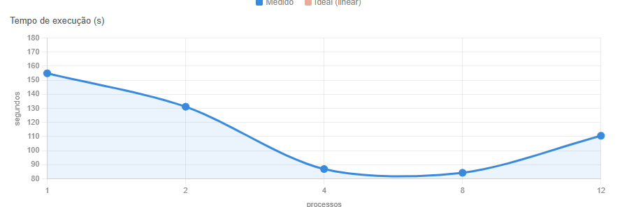
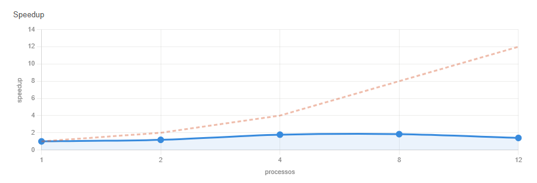
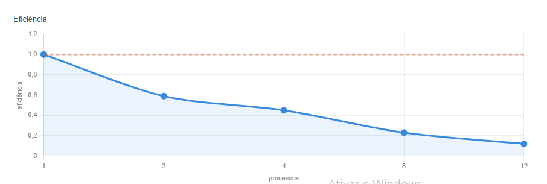

# Benchmark de Paralelismo com Multiprocessing em Python

**Disciplina:** Programação Concorrente e Distribuída  
**Aluno:** Lucas Vasconcelos Pessoa de Oliveira, Joao Gabriel Lucas Pinheiro de Lima, Gabriel Yan Ribeiro da Costa, Waldo Andrade Silva
**Turma:** ADSN04  
**Professor:** Rafael  
**Data:** 01/04/2026  

---

## 1. Descrição do Problema

O programa foi feito pra processar uma **imagem PPM de ~16 GB** em paralelo, dividindo o trabalho entre vários processos ao mesmo tempo pra ver se fica mais rápido.

A imagem é dividida em partes horizontais iguais. Cada parte é convertida individualmente para escala de cinza usando a fórmula de luminância padrão. No final, todas as partes são reunidas em uma única imagem de saída.

| Pergunta | Resposta |
|----------|----------|
| Objetivo | Converter uma imagem PPM de ~16 GB para escala de cinza em paralelo e comparar os tempos |
| Volume de dados | Imagem 75672x75672 pixels — ~16 GB — dividida em 12 partes |
| Algoritmo | Divisão horizontal da imagem + processamento paralelo com `multiprocessing.Pool.map()` chamando `conversoremescalacinza.py` como subprocesso |
| Complexidade | O(N/p) — quanto mais processos, menos pixels por processo |

---

## 2. Ambiente Experimental

| Item | Descrição |
|------|-----------|
| Processador | 12th Gen Intel Core i7-12700 — 2.10 GHz |
| Número de núcleos | 12 núcleos físicos / 20 threads lógicas |
| Memória RAM | 16,0 GB (utilizável: 15,7 GB) |
| Sistema Operacional | Windows 11 — 64 bits |
| Linguagem utilizada | Python 3.13 |
| Biblioteca de paralelização | `multiprocessing` (já vem com o Python) |
| Compilador / Versão | CPython 3.13 |

---

## 3. Metodologia de Testes

O tempo foi medido usando `time.time()`, contando o tempo total do processamento paralelo — da criação dos processos até a conclusão de todas as partes.

Cada configuração foi rodada **1 vez**, com a pasta `partes_cinza/` limpa antes de cada execução para garantir que os resultados não fossem influenciados por arquivos já existentes.

### Configurações testadas

- 1 processo
- 2 processos
- 4 processos
- 8 processos
- 12 processos

---

## 4. Resultados Experimentais

| Nº Processos | Tempo de Execução (s) |
|:------------:|:---------------------:|
| 1            | 154.95                |
| 2            | 131.24                |
| 4            | 86.96                 |
| 8            | 84.31                 |
| 12           | 110.60                |

---

## 5. Cálculo de Speedup e Eficiência

O **speedup** mostra quantas vezes ficou mais rápido em relação ao tempo sem paralelismo:

```
Speedup(p) = T(1) / T(p)
```

A **eficiência** mostra se os processos estão sendo bem aproveitados (1,0 seria o ideal):

```
Eficiência(p) = Speedup(p) / p
```

---

## 6. Tabela de Resultados

| Processos | Tempo (s) | Speedup | Eficiência |
|:---------:|:---------:|:-------:|:----------:|
| 1         | 154.95    | 1.00    | 1.00       |
| 2         | 131.24    | 1.18    | 0.59       |
| 4         | 86.96     | 1.78    | 0.45       |
| 8         | 84.31     | 1.84    | 0.23       |
| 12        | 110.60    | 1.40    | 0.12       |

> **Melhor resultado: 8 processos (84.31s)**

---

## 7. Gráfico de Tempo de Execução



---

## 8. Gráfico de Speedup



---

## 9. Gráfico de Eficiência



---


## 10. Análise dos Resultados

O ganho de desempenho foi modesto comparado ao ideal teórico. Com 2 processos a melhora foi pequena (1.18x), provavelmente por contenção de I/O já nesse nível. Com 4 processos o ganho foi mais expressivo (1.78x), e com 8 processos chegou ao melhor resultado (1.84x). Com 12 processos o tempo piorou significativamente — subindo de 84.31s para 110.60s.

O principal fator limitante nesse experimento é o **gargalo de I/O em disco**. Como a imagem tem ~16 GB, todos os processos precisam ler e escrever grandes volumes de dados simultaneamente, gerando contenção no acesso ao armazenamento. Diferente de workloads puramente computacionais, aqui o disco é o gargalo — não a CPU.

O comportamento com 12 processos tem uma explicação adicional: o i7-12700 possui arquitetura híbrida com **8 P-cores (Performance)** e **4 E-cores (Eficiência)**. Com 12 processos, os 4 extras foram alocados nos E-cores, que são mais lentos. Como o `pool.map` aguarda todos os processos terminarem, os E-cores atrasaram o tempo total.

A eficiência caiu rapidamente com o aumento de processos (de 0.59 com 2 processos para 0.12 com 12), confirmando que o overhead de I/O e a arquitetura híbrida superam o ganho de paralelismo a partir de um certo ponto.

**Principais fatores limitantes:**
- Contenção de I/O — múltiplos processos lendo/escrevendo no mesmo disco simultaneamente
- Arquitetura híbrida do i7-12700 — E-cores mais lentos penalizam o tempo total com 12 processos
- Overhead de criação e gerenciamento dos subprocessos
- Memória RAM limitada para buffers simultâneos de leitura

---

## 11. Conclusão

O paralelismo trouxe ganho moderado de desempenho, reduzindo o tempo de 154.95s para 84.31s com 8 processos (speedup de 1.84x).

O ganho não foi linear porque o gargalo principal é o acesso ao disco, não a capacidade de processamento da CPU. Com 12 processos o tempo piorou em relação a 8, explicado pela combinação de contenção de I/O e pela arquitetura híbrida do i7-12700 — os 4 E-cores mais lentos atrasaram o tempo total do pool.

**Melhorias futuras:**
- Usar SSD NVMe para reduzir o gargalo de I/O
- Processar os pixels em memória sem escrita intermediária em disco
- Executar múltiplas vezes e calcular média para maior confiabilidade dos resultados
- Testar com `ProcessPoolExecutor` do `concurrent.futures` para comparação
